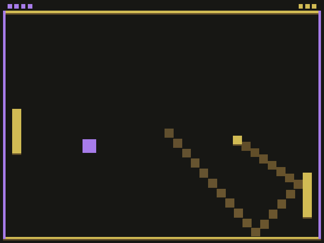

# Dodge

Author: Michelle Chang

Design: Modified the game of Pong into a game that is similar to dodgeball. The player will play against two AI paddles, and can score points by catching the ball successfully.

Screen Shot:

How To Play:

Move the player with mouse motion.
Catch the ball by pressing the space bar when: 1) the player comes close to the ball and 2) the ball bounces off walls on left or right sides of the court.

This game was built with [NEST](NEST.md).
